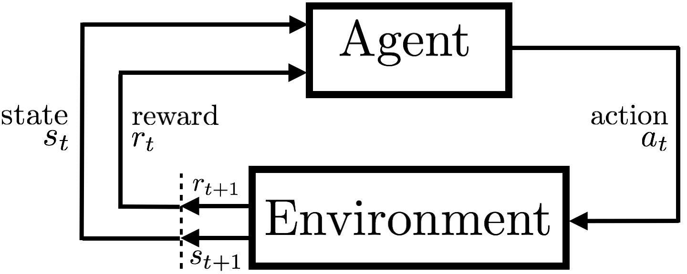

This week was an introduction to MDPs. 

#### Module 3 Learning objective

**Lesson 1: Introduction to Markov Decision Processes**

* Understand Markov Decision Processes, or MDPs

  MDP is a sequential decision making process, where an agent interacts with the environment through actions and rewards to figure out how to meet its goal. 

* Describe how the dynamics of an MDP are defined

  The current action is only dependent on the last action and state, not from the ones from further past. Also, the current action has long-term consequences, not just on immediate reward. 

* Understand the graphical representation of a Markov Decision Process

  

  The diagram shows the interaction between agent and environment. When the agent takes an action, the environment responds through rewards and updating the states. This repeats until termination in finite MDP. 

* Explain how many diverse processes can be written in terms of the MDP framework

  States, actions, rewards can be in various forms. Therefore, as a researcher, it is important to be able to design a good system depending on your task. Tons of real life examples of MDP! 

**Lesson 2: Goal of Reinforcement Learning**

- Describe how rewards relate to the goal of an agent

  Agent's goal is to maximize the total reward. Since reward is essentially the main motivation for the agent to learn, it is very important to design a good reward function. It should be designed such that it tells the agent "what you want it to achieve, not how you want it achieved". 

- Understand episodes and identify episodic tasks

  Episodes are a single trajectory that the agent takes from beginning to and end. Unlike continuing tasks, episodic tasks terminate. Each episodes are independent of another and can vary in length and outcome. 

**Lesson 3: Continuing Tasks**

- Formulate returns for continuing tasks using discounting
  $$
  G_t = R_{t+1} + \gamma R_{t+2} + \gamma R_{t+3} + ... 
  $$

  $$
  = \sum_{k=0}^{\infty} R_{t + k + 1}
  $$

  

- Describe how returns at successive time steps are related to each other
  $$
  G_t = R_{t+1} + \gamma G_{t+1}
  $$
  

- Understand when to formalize a task as episodic or continuing

  If a task can be run multiple times until a terminal state, then it has episodes, However, if a task continues forever or for a very long time, then it is considered as continuing. 

#### Exercises for RLBook Chapter 3 

**3.1** Devise three example tasks of your own that fit into the MDP framework 

1. Recommend songs to users

* action :  select a song that user might like to listen 
* reward : the user clicks and listens to the recommended song 
* state : list of songs that the user listened to so far 

2. Growing plants
   * action : how much water to give to the plants 
   * reward : rate of growth and whether it dies early 
   * state : temperature, sunlight, nutrients in the soil 
3. Finance 
   * action : how much to invest in stock
   * reward : the amount of gain over a given time period
   * state : market state 

**3.2** Is the MDP framework adequate to usefully represent all goal-directed learning tasks? Can you think of any clear exceptions? 

Exceptions 

* When there is no clear reward for every action
* If there are no discrete "states" or stages 
* If multiple actions lead to a reward or one action influences multiple rewards in different ways 

**3.3** What is the right level, the right place to draw the line between agent and environment? On what basis is one location of the line to be preferred over another? Is there any fundamental reason for preferring one location over another, or is it a free choice? 

There is no right formula for determining the correct location of the line. It is a design choice. But there is a better and a worse design. The line should be drawn at a point where the agent can confidently act and manipulate its environment. There should be a clear action -> reward mapping. 

**3.5** 

$\sum_{s'}\sum_a p(s',a|s,a) $ for all $s \in S^+$ and $a \in A(s)$ when $s \neq S_T$ . 

In the book, $S^+$ is defined as all the states, including the terminal state. 

**3.6** The return would be -1 * the discount rate ^ (steps left until failure). Therefore, if the return value is small, it means that shortly in the future, the cart will fail. 

**3.7** The reward is too small (it is received too far in the future) and the robot is not penalized for escaping quickly, since the reward is 0 for all situations except on escape. It would be better to assign -1 for all the steps taken. 

**3.8** 
$$
G_5 = 0
$$

$$
G_4 = R_5  + \gamma G_5 = 2 + 0.5 * 0 = 2 
$$

$$
G_3 = R_4 + \gamma G_4 = 3 + 0.5 * 2 = 4
$$

$$
G_2 = R_3 + \gamma G_3 = 6 + 0.5 * 4 = 8
$$

$$
G_1 = R_2 + \gamma G_2 = 2 + 0.5 * 8 = 6 
$$

$$
G_0 = R_1 + \gamma G_1 = -1 + 0.5 * 6 = 2 
$$

**3.9** 
$$
G_1 = R + \gamma G_2 = R + \gamma R + \gamma^ 2R + \gamma^3R + ...
$$

$$
= R \sum_{k=0}^{\infty} \gamma ^ k = R\frac{1}{1-\gamma} = 7*\frac{1}{0.1} = 70
$$

$$
G_0 = R_1 + \gamma G_1 = 2 + 0.5 * 70 = 37
$$

**3.10** This is the inifinite geometric sum. 

