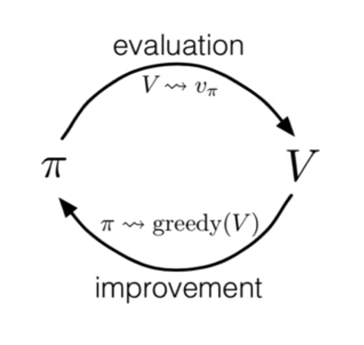

#### Module 5 Learning Objectives

**Lesson 1: Policy Evaluation (Prediction)**

- Understand the distinction between policy evaluation and control

  Policy evaluation is to compute the state value function of a given policy. Policy control is finding the "best" policy with the computed value function of the current policy. 

- Explain the setting in which dynamic programming can be applied, as well as its limitations

  Dynamic programming assumes that we know the perfect model of the environment, which is not practical in real applications. Also, DP looks at all the states at every iteration in order to update, which can be computationally expensive as number of states get larger.

  "The key idea of DP, and of RL generally, is the use of value functions to organize and structure the search for good policies". 

- Outline the iterative policy evaluation algorithm for estimating state values under a given policy

  First, we start with a random policy (ex. random uniform) and initialize the value of the states. Using this initial policy, we compute the value function at each state using the Bellman equation and update them. Repeat until there is no more improvement. 

- Apply iterative policy evaluation to compute value functions

**Lesson 2: Policy Iteration (Control)**

- Understand the policy improvement theorem

  If a state-action value at state s, following the policy $\pi'$,  $q_\pi(s, \pi'(s)) \geq v_\pi(s)  $ , is greater or equal to the value at state s following the policy $\pi$, then the policy $\pi'$ must be as good as or better than the policy $\pi$. 

- Use a value function for a policy to produce a better policy for a given MDP
  $$
  \pi' (s) = argmax_a q_\pi(s,a)
  $$
   

- Outline the policy iteration algorithm for finding the optimal policy

  We can iteratively improve the policy by alternating between evaluating and improving. 

  1. Evaluate the current policy until convergence
  2. Improve the current policy by the updated value function from 1 
  3. Go back to 1. if policy is not stable yet (If there is a change in policy from before)

- Understand “the dance of policy and value”

- Apply policy iteration to compute optimal policies and optimal value functions

**Lesson 3: Generalized Policy Iteration**

- Understand the framework of generalized policy iteration

  GPI is a process of alternating between policy evaluation and improvement. Policy iteration is when both policy evaluation and improvement is run until completion. Value iteration is when policy evaluation is done once for each state and then move on to policy improvement. In asynchronous dp, not even all the states are updated once. GPI encompasses all granulity of update. Its main idea is to move back and forth between evaluation and improvement until finding the optimal policy. 

- Outline value iteration, an important example of generalized policy iteration

  Instead of running policy evaluation until convergence with bellman expectation equation, value iteration uses bellman optimality equation to run policy evaluation once and update the policy immediately. 

- Understand the distinction between synchronous and asynchronous dynamic programming methods

  Asynchronous dynamic programming don't update all the state value in each iteration. Therefore, some states get updated more often than the others. This is computationally useful when there are too many states. 

- Describe brute force search as an alternative method for searching for an optimal policy

  Brute force search computes the value for every single possible policy. It is $n_s^{n_a}$ so the number of computation is huge. 

- Describe Monte Carlo as an alternative method for learning a value function

  Why do you need large return values? 

  Monte Carlo method is commonly used when we don't know the exact environment dynamics. We compute the state value by randomly sampling many times and average the sampled returns. We need large number of return values because that is the only way to closely estimate the true state value. 

- Understand the advantage of Dynamic programming and “bootstrapping” over these alternative strategies for finding the optimal policy

#### Exercises from the book

**4.1** In example 4,1, if $\pi$ is the equiprobable random policy, what is $q_\pi (11, down)$? 

What is $q_\pi(7,down)$? 

$q_\pi(11,down) = -1$ 

$q_\pi(7,down) = -1 + v_\pi(11) = -1 + (-14) = -15$

**4.2** In example 4.1, suppose a new state 15 is added to the grid world just below state 13, and its actions, left, up, right and down, tkae the agent to states, 12, 13, 14, 15, respectively. Assume that the transitions from the original states are unchanged. What, then, is $v_\pi(15)$ for the equiprobable random policy? 
$$
v_\pi(15) = -1 + 0.25[v_\pi(12) + v_\pi(13) + v_\pi(14) + v_\pi(15)]
$$

$$
= -1 + 0.25(-22-20-14+v_\pi(15))
$$

$$
= -15 + 0.25 v_\pi(15)
$$

$$
0.75 v_\pi(15) = -15
$$

$$
v_\pi(15) = -20
$$

**4.3** What are the equations analogous to (4.3), (4.4) and (4.5) for the action value function $q_\pi$ and its successive approximation by a sequence of functions $q_0, q_1,...$? 
$$
q_\pi = \mathbb{E}_\pi[R_{t+1} + \gamma \sum_{s',r'} q_\pi(s',a') | S_t=s, A_t=a]
$$

$$
= \sum_{s',r}p(s',r|s,a)[r+\gamma\sum_{a'}\pi(a'|s')q_\pi(s',a')]
$$

**4.4** In some undiscounted episodic tasks there may be policies for which eventual termination is not guaranteed. For example, in the grid problem above it is possible to go back and forth between two states forever. In a task that is otherwise perfectly sensible,  may be negative infinity for some policies and states, in which case the algorithm for iterative policy evaluation given in Figure [ 4.1](https://www.cs.huji.ac.il/course/2009/control/handouts/RL/www.cs.ualberta.ca/_sutton/book/ebook/node41.html#fig:policy-evaluation) will not terminate. As a purely practical matter, how might we amend this algorithm to assure termination even in this case? Assume that eventual termination *is* guaranteed under the optimal policy.

**4.6** How would policy iteration be defined for action values? Give a complete algorithm for computing , analogous to Figure [ 4.3](https://www.cs.huji.ac.il/course/2009/control/handouts/RL/www.cs.ualberta.ca/_sutton/book/ebook/node43.html#fig:policy-iteration) for computing . Please pay special attention to this exercise, because the ideas involved will be used throughout the rest of the book.

1. Initialize $Q(s,a)$ and $\pi(s)$.

2. Policy evaluation

   Repeat 

   ​	$\Delta$ = 0 

   ​	For each s and each a :

   ​		$q = Q(s,a)$

   ​		$Q(s,a) = \sum_{s',r} p(s',r|s,a)[r + \gamma V(s')]$  

   ​		$\Delta = max (\Delta, |q - Q(s,a)|)$ 

   Until $\Delta < \theta$ 

3. Policy improvement 

   policy-stable = True

   For each s and each a :

   ​	old_action = $\pi(s)$ 

   ​	$\pi(s) = argmax_a Q(s,a)$ 

   ​	If old_action != $\pi(s)$ , then policy-stable = False

   If policy-stable, stop else, return to 2

   

   **4.7** Suppose you are restricted to considering only policies that are *-soft*, meaning that the probability of selecting each action in each state, , is at least . Describe qualitatively the changes that would be required in each of the steps 3, 2, and 1, in that order, of the policy iteration algorithm for  (Figure [ 4.3](https://www.cs.huji.ac.il/course/2009/control/handouts/RL/www.cs.ualberta.ca/_sutton/book/ebook/node43.html#fig:policy-iteration))

   

   **4.8** Why does the optimal policy for the gambler's problem have such a curious form? In particular, for capital of 50 it bets it all on one flip, but for capital of 51 it does not. Why is this a good policy?

   

   **4.10** What is the analog of the value iteration backup [(4.10)](https://www.cs.huji.ac.il/course/2009/control/handouts/RL/www.cs.ualberta.ca/_sutton/book/ebook/node44.html#eq:value_iteration) for action values, 

   

   

